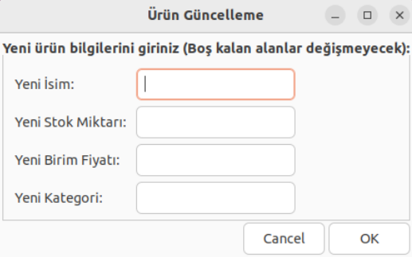
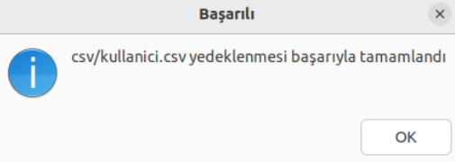

# Linux Araçları ve Kabuk Programlama Dersi Zenity Uygulaması Ödevi

## Ödevin Özeti
- Zenity araçlarını kullanarak, ürün ekleme, listeleme, güncelleme ve silme vb. işlemlerini destekleyen, kullanıcı dostu bir grafik arayüz sağlayan basit bir envanter yönetim sistemi.

## Youtube Tanıtım Videosu Linki
 [Youtube Tanıtım Videosu](https://youtu.be/CdQimTn2Q0E)

## Fonksiyonlar

- Kullanıcı Rolleri
  - Yönetici
  - Kullanıcı
- Veri Saklama (depo.csv, kullanici.csv, log.csv)
- Ana Menü
  - Ürün Ekle
  - Ürün Listele
  - Ürün Güncelle
  - Ürün Sil
  - Rapor Al
    - Stokta Azalan Ürünler (Eşik değeri sağlanmalı)
    - En Yüksek Stok Miktarına Sahip Ürünler (Eşik değeri sağlanmalı)
  - Kullanıcı Yönetimi
    - Yeni Kullanıcı Ekle
    - Kullanıcıları Listele
    - Kullanıcı Güncelle
    - Kullanıcı Silme
  - Program Yönetimi
    - Diskteki Alanı Göster (.sh + depo.csv + kullanici.csv + log.csv)
    - Diske Yedekle (depo.csv + kullanici.csv)
    - Hata Kayıtlarını Göster (log.csv)
  - Çıkış

## Ekran Görüntülü Sistem Anlatımı
- Giriş Ekranı
  - 
  - Bu ekran uygulama çalıştırılınca açılan ilk ekrandır. Giriş yapmanızı sağlar. Eğer herhangi bir hesap oluşturulmadıysa "admin" "admin" girdileriyle sisteme giriş yapabilirsiniz.
- Ana Menü
  - 
  - Bu ekran bizim ana menümüzü gösteren ekrandır. Buradaki seçeneklerden istenen seçenek seçilebilir. Kullanıcılar buradaki işlemlerden yalnızca ürün listeleme ve rapor kısımlarını kullanabilirler.
- Ürün Ekle
  - 
  - Bu ekran bizim csv klasörümüz altında bulunan depo.csv dosyasına ürün eklememizi sağlamakta. Buraya yazılan bilgiler id,ad,stok,fiyat,kategori tarzındaki bir formatta depolanır. Aynı isimde ürün eklenmesine izin verilmez.
- Ürün Listeleme
  - 
  - depo.csv dosyamızdaki ürünlerimizin hepsini ekrana listeler.
- Ürün Güncelleme
  -  
  - İlk ekranda güncellemek istediğimiz ürünün adı girilir. Sonrasında ise ikinci ekran bizi karşılar. Burada istenen güncellemeler yapılır. Boş bırakılan kısımlar için eski bilgiler korunur. Onay verildiğinde ise depo.csv dosyasında gerekli güncellemeler yapılır.
- Ürün Silme
  -  
  - İlk ekranda silinecek ürünü neye göre sileceğimiz istenir. Burada seçilen seçeneğe göre ikinci ekrandan alınan bilgi doğrultusunda depo.csv dosyası içinde bu veri aranır. Silme işlemi geri alınamaz bir işlem olduğundan dolayı sistem emin olup olmadığınızı doğrular. Silme işlemi başarılı olunca başarılı olduğunu belirten bir mesaj yazılır.
- Rapor Al
  - 
  - Bu seçenek seçildiğinde, bizi raporlama menüsü karşılar. Burada yapılamk istenen işleme göre seçenek seçilir.
    - Stokta Az Kalan Ürünler
      - 
      - Burada depo.csv içerisindeki stokta sayı olarak 50'nin altına düşmüş ürünler ekrana yazdırılır.
    - En Yüksek Stok Miktarına Sahip Ürün
      - 
      - Burada depo.csv içerisindeki ürünlerden stokta en fazla bulunan ekrana yazdırılır.
- Kullanıcı Yönetimi
  - 
  - Bu seçenek seçildiğinde bizi kullanıcı yönetim menüsü karşılar. Burada yapılamk istenen işleme göre seçenek seçilir.
    - Kullanıcı Ekle
      -  
      - Bu işlem sistemimize hesap eklememizi sağlar. İstenen bilgiler önümüze gelen ekrana girilir. Rol kısmı "admin" veya "user" olmak zorundadır. Bilgiler istenildiği gibi girildikten sonra ekleme başarılı olursa bu kullanıcıya bilgi verilir.
    - Kullanıcıları Listele
      - 
      - Bu seçenek seçildiğinde kullanici.csv dosyasında kayıtlı tutulan kullanıcılar ekrana yazdırılır.
    - Kullanıcı Güncelle
      -  
      - Bu seçenek seçildiğinde önce güncellenecek hesabın kullanıcı adı istenir. Sonrasında ise gelen formda güncellenmesi istenen kısımlar doldurulur. Boş kalan kısımlar eski halinde kalır. İşlem tamamlanırken bu işlemin gerçekleşmesini isteyip istemediğimizi emin olmak için sistem bize sorar. Onay verilirse güncelleme işlemi tamamlanmış olur.
    - Kullanıcı Sil
      -  
      - Bu seçenek seçildiğinde bize iki seçenek sunar. ID ile mi silmek istiyoruz yoksa kullanıcı adı ile mi silmek istiyoruz bunu belirleriz. Belirleyip seçeneği seçtikten sonra ise istenen bilgiyi gireriz. Bu işlem geri alınamayacak bir işlem olduğu için sistem bize emin olup olmadığımızı sorar. Onay verdiğimizde ise işlem gerçekleşir ve kullanıcı silinir.
    - Hesap Kilidi Aç
      - 
      - Bu seçenek, eğer bir hesaba 3 kez başarısız giriş denemesi yapıldıysa kilitlnen hesabın kilidini açmamızı sağlar. Gelen girdi kısmına kildini açmak istediğimiz hesabın kullanıcı adını girmemiz gerekir. Giriş sonrasında hesap kilitliyse kilidi açılır.
- Program Yönetimi
  - 
  - Bu seçenek seçildiğinde bizi program yönetim menüsü karşılar. Burada yapılamk istenen işleme göre seçenek seçilir.
    - Diskte Kaplanan Alan
      - 
      - Bu seçenek, bizim sistemimizin ve sistemde kullanılan csv dosyalarının kapladığı boyutu belirten bir ekran belirtir.
    - Diske Yedek Alma
      -  
       
      - Bu seçenek, yöneticinin istemesi durumunda dosyaları hard link yoluyla yedeklemeyi sağlar.
    - Hata Kayıtlarını Görüntüleme
      - 
      - Bu seçenek ile log.csv dosyamızdaki hata kayıtları bir ekran aracılığıyla gösterilir.
- Başarı Ekranı
  - 
  - Ürün ekleme gibi bazı işlemlerin başarılı olması sonucunda bilgi veren ve başarıyı gösteren bir ekran bizi karşılar
- Çıkış Onay Ekranı
  - 
  - Sistemden çıkış yapılırken çıkış istemi doğrulanır.

## Bilinmesi Gerekenler
- Program ilk başlatıldığında dosyaları otomatik olarak oluşturacaktır. Bu süreçte hiçbir kullanıcı sisteme henüz kayıtlı olmayacağından dolayı sisteme giriş yapılamayacaktı. Bu durumu engelleme amaçlı kod içerisinde tanımlı, kullanıcı adı ve şifresi "admin" olan özel hesapla sisteme giriş yapabilirsiniz.
- **Yönetici(admin) hesaplar**; ürün ekleme, güncelleme, silme ve kullanıcı yönetimi yapabilmektedir.
- **Kullanıcı(user) hesaplar**; sadece ürünleri görüntüleyebilmekte ve rapor alabilmektedir.
- Kayıtlar, loglar, depolamalar gibi işlemler sistem tarafından oluşturulan csv klasörü içerisinde bulunurlar. Sistem ilk çalıştırıldığı anda bu klasör ve içinde bulunması gereken dosyalar oluşturulur.
- Yöneticilerin ve kulanıcıların şifreleri MD5 yöntemi ile şifrelenmiş bir şekilde depolanır. Bu sayede veri güvenliği sağlanır.
- Sistem her işlem yaptığında .tempBackup adlı gizli bir klasör içerisinde bilgileri depolar, bu da herhangi beklenmedik bir durum sonucunda veri kaybını önler.

## Hazırlayan
- **Eren Köse** - 22360859075 - Bursa Teknik Üniversitesi Bilgisayar Mühendisliği 3.Sınıf Öğrencisi
