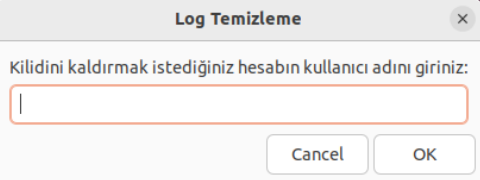

# Linux Araçları ve Kabuk Programlama Dersi Zenity Uygulaması Ödevi

## Ödevin Özeti
- Zenity araçlarını kullanarak, ürün ekleme, listeleme, güncelleme ve silme vb. işlemlerini destekleyen, kullanıcı dostu bir grafik arayüz sağlayan basit bir envanter yönetim sistemi.

## Youtube Tanıtım Videosu Linki
 [Youtube Tanıtım Videosu](https://youtu.be/CdQimTn2Q0E)

## Github Reposu Linki
 [Github Reposu](https://github.com/erennkose/linux-zenity-app)

## Fonksiyonlar

- Kullanıcı Rolleri
  - Yönetici
  - Kullanıcı
- Veri Saklama (depo.csv, kullanici.csv, log.csv)
- Ana Menü
  - Ürün Ekle
  - Ürün Listele
  - Ürün Güncelle
  - Ürün Sil
  - Rapor Al
    - Stokta Azalan Ürünler (Eşik değeri sağlanmalı)
    - En Yüksek Stok Miktarına Sahip Ürünler (Eşik değeri sağlanmalı)
  - Kullanıcı Yönetimi
    - Yeni Kullanıcı Ekle
    - Kullanıcıları Listele
    - Kullanıcı Güncelle
    - Kullanıcı Silme
    - Hesap Kilidi Açma
  - Program Yönetimi
    - Diskteki Alanı Göster (main.sh + depo.csv + kullanici.csv + log.csv)
    - Diske Yedekle (depo.csv + kullanici.csv + log.csv)
    - Hata Kayıtlarını Göster (log.csv)
  - Çıkış

## Ekran Görüntülü Sistem Anlatımı

### Giriş Ekranı
 
Bu ekran uygulama çalıştırılınca açılan ilk ekrandır. Giriş yapmanızı sağlar. Eğer herhangi bir hesap oluşturulmadıysa "admin" "admin" girdileriyle sisteme giriş yapabilirsiniz.

---

### Ana Menü
 
Bu ekran bizim ana menümüzü gösteren ekrandır. Buradaki seçeneklerden istenen seçenek seçilebilir. Kullanıcılar buradaki işlemlerden yalnızca ürün listeleme ve rapor kısımlarını kullanabilirler.

#### Ürün Ekle
 
- Bu ekran bizim `csv` klasörümüz altında bulunan `depo.csv` dosyasına ürün eklememizi sağlar.
- Buraya yazılan bilgiler `id, ad, stok, fiyat, kategori` formatında depolanır.
- Aynı isimde ürün eklenmesine izin verilmez.

#### Ürün Listeleme
 
`depo.csv` dosyamızdaki ürünlerin hepsini ekrana listeler.

#### Ürün Güncelleme
- **Adım 1:**  
   
  İlk ekranda güncellemek istediğimiz ürünün adı girilir.
- **Adım 2:**  
   
  İkinci ekranda istenen güncellemeler yapılır. Boş bırakılan kısımlar için eski bilgiler korunur. Onay verildiğinde ise `depo.csv` dosyasında gerekli güncellemeler yapılır.

#### Ürün Silme
- **Adım 1:**  
   
  İlk ekranda silinecek ürünü neye göre sileceğimiz istenir.
- **Adım 2:**  
   
  Seçilen seçeneğe göre ikinci ekrandan alınan bilgi doğrultusunda `depo.csv` dosyası içinde bu veri aranır. Silme işlemi geri alınamaz olduğundan sistem emin olup olmadığınızı doğrular. İşlem başarılı olunca bir başarı mesajı görüntülenir.

---

### Rapor Al
 
Bu seçenek seçildiğinde, bizi raporlama menüsü karşılar. Burada yapılmak istenen işleme göre seçenek seçilir.

- **Stokta Az Kalan Ürünler**  
   
  `depo.csv` içerisindeki stok sayısı 50'nin altına düşmüş ürünler ekrana yazdırılır.

- **En Yüksek Stok Miktarına Sahip Ürün**  
   
  `depo.csv` içerisindeki ürünlerden stokta en fazla bulunan ürün ekrana yazdırılır.

---

### Kullanıcı Yönetimi
 
Bu seçenek seçildiğinde bizi kullanıcı yönetim menüsü karşılar. Burada yapılmak istenen işleme göre seçenek seçilir.

- **Kullanıcı Ekle**
  - **Adım 1:**  
     
    Kullanıcı bilgileri girilir.
  - **Adım 2:**  
     
    Rol kısmı "admin" veya "user" olmak zorundadır. İşlem başarılı olursa kullanıcıya bilgi verilir.

- **Kullanıcıları Listele**  
   
  `kullanici.csv` dosyasında kayıtlı kullanıcılar ekrana yazdırılır.

- **Kullanıcı Güncelle**
  - **Adım 1:**  
     
    Güncellenecek hesabın kullanıcı adı istenir.
  - **Adım 2:**  
     
    Güncellenmesi istenen kısımlar doldurulur. Boş kalan kısımlar eski haliyle kalır. İşlem onaylandıktan sonra güncelleme tamamlanır.

- **Kullanıcı Sil**
  - **Adım 1:**  
     
    Kullanıcıyı silmek için ID ya da kullanıcı adı seçilir.
  - **Adım 2:**  
     
    İşlem geri alınamayacak olduğundan emin olmanız istenir. Onaylandığında işlem tamamlanır.

- **Hesap Kilidi Aç**  
   
  3 kez başarısız giriş denemesi nedeniyle kilitlenen hesabın kilidini açmak için bu seçenek kullanılır.

---

### Program Yönetimi
 
Bu seçenek seçildiğinde bizi program yönetim menüsü karşılar. Burada yapılmak istenen işleme göre seçenek seçilir.

- **Diskte Kaplanan Alan**  
   
  Sistemin ve kullanılan `csv` dosyalarının kapladığı boyut belirtilir.

- **Diske Yedek Alma**
  - **Adım 1:**  
     
    Yedekleme işlemi başlatılır.
  - **Adım 2:**  
     
  - **Adım 3:**  
     
  - **Adım 4:**  
     
    Hard link yoluyla yedekleme tamamlanır.

- **Hata Kayıtlarını Görüntüleme**  
   
  `log.csv` dosyasındaki hata kayıtları ekrana gösterilir.

---

### Başarı Ekranı
 
Ürün ekleme gibi işlemlerin başarılı olması durumunda bilgi veren bir ekran bizi karşılar.

---

### Çıkış Onay Ekranı
 
Sistemden çıkış yapılırken çıkış istemi doğrulanır.

## Bilinmesi Gerekenler
- Program ilk başlatıldığında dosyaları otomatik olarak oluşturacaktır. Bu süreçte hiçbir kullanıcı sisteme henüz kayıtlı olmayacağından dolayı sisteme giriş yapılamayacaktı. Bu durumu engelleme amaçlı kod içerisinde tanımlı, kullanıcı adı ve şifresi "admin" olan özel hesapla sisteme giriş yapabilirsiniz.
- **Yönetici(admin) hesaplar**; ürün ekleme, güncelleme, silme ve kullanıcı yönetimi yapabilmektedir.
- **Kullanıcı(user) hesaplar**; sadece ürünleri görüntüleyebilmekte ve rapor alabilmektedir.
- Kayıtlar, loglar, depolamalar gibi işlemler sistem tarafından oluşturulan csv klasörü içerisinde bulunurlar. Sistem ilk çalıştırıldığı anda bu klasör ve içinde bulunması gereken dosyalar oluşturulur.
- Yöneticilerin ve kulanıcıların şifreleri MD5 yöntemi ile şifrelenmiş bir şekilde depolanır. Bu sayede veri güvenliği sağlanır.
- Sistem her işlem yaptığında .tempBackup adlı gizli bir klasör içerisinde bilgileri depolar, bu da herhangi beklenmedik bir durum sonucunda veri kaybını önler.

## Hazırlayan
- **Eren Köse** - 22360859075 - Bursa Teknik Üniversitesi Bilgisayar Mühendisliği 3.Sınıf Öğrencisi
